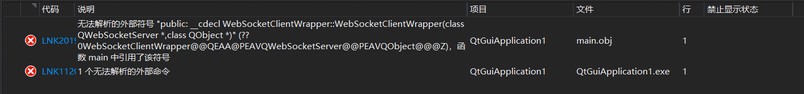
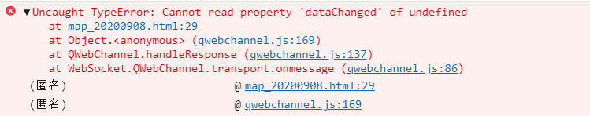
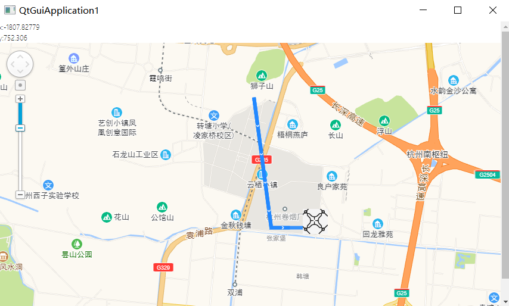
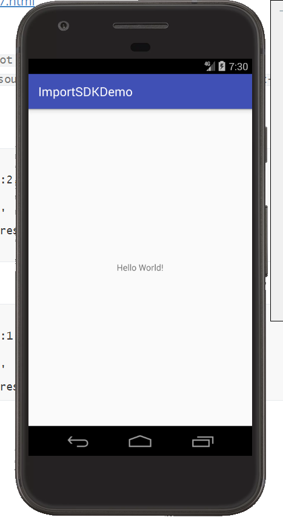
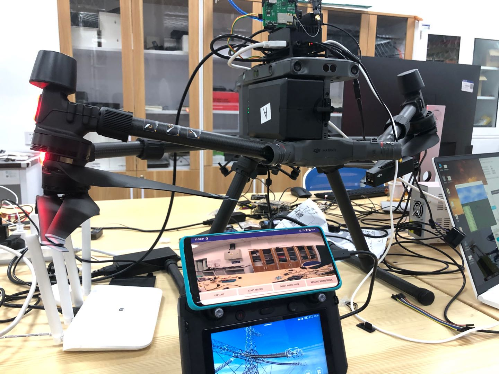
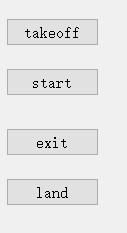
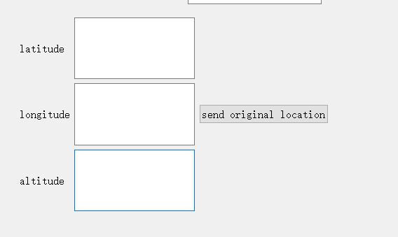
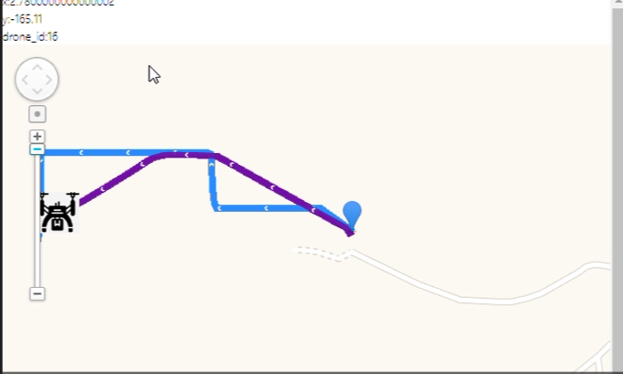

#### 2020.8.31

安装visual studio和Qt，

发现vs2019里没有Qt GUI，后来上谷歌上查发现，Qt在vs2019之中的版本是不包含GUI的，正常下载即可。

#### 2020.9.1

学习Qt基本知识

#### 2020.9.2

数据拿到的是相对原点的距离，单位为米。

因此为了把轨迹点标记在地图上面，得将米转换为经纬度：

一开始发现高德给的api是有经纬度和三维坐标的转换，然而它转换的单位是像素，所以不可以使用。

思路可以参考下面这篇文章，

[https://blog.csdn.net/jinshitou2012/article/details/81387246?utm_medium=distribute.pc_aggpage_search_result.none-task-blog-2~all~first_rank_v2~rank_v25-10-81387246.nonecase&utm_term=%E4%B8%80%E7%B1%B3%E8%BD%AC%E6%8D%A2%E6%88%90%E7%BB%8F%E7%BA%AC%E5%BA%A6](https://blog.csdn.net/jinshitou2012/article/details/81387246?utm_medium=distribute.pc_aggpage_search_result.none-task-blog-2~all~first_rank_v2~rank_v25-10-81387246.nonecase&utm_term=一米转换成经纬度)

我利用了高德自带的distance功能测出，在当前中心点增加一度经度和一度维度时分别平移的距离，因此可以得到平移一米时，经纬度的的增加。

今天在原有的基础上加了x,y,z和vx,vy模块。

#### 2020.9.3

通过另一种更加高效的方法添加了x,y,z和vx,vy模块。

用的是Qt designer.

学习了用zigbee收发数据。

#### 2020.9.4

发现了Qt 自带的readyRead()程序的功能是当有新的消息到的时候 return true,并不是串口能接受消息了return true,之前的理解有问题。

成功接受了数据，并且解码成功。

#### 2020.9.7

学习HTML和QT之间的交互

需要添加几个头文件。


#include <QtWebSockets/qwebsocket.h>
#include <QtWebSockets/qwebsocketserver.h>

#### 2020.9.8

尝试使用以下网站中的方法，发现webview并没有成员函数mianFrame()，因此无法利用这里面的办法。

https://www.cnblogs.com/andreitang/archive/2011/08/02/2125166.html

只有尝试了用Webchannel来传递对象给html，在编译过程中发现了有无法解析的外部符号的问题，初步判断是编译过程中，少了一些必要的文件。



找到了解决办法，具体参考下面的网址

https://blog.csdn.net/tjq980303/article/details/54585369

需要添加相应的第三方库才能继续编译。

互相进行值传递主要参考：

https://blog.csdn.net/qq_41961619/article/details/107104622?ops_request_misc=%257B%2522request%255Fid%2522%253A%2522159879761519195265920160%2522%252C%2522scm%2522%253A%252220140713.130102334.pc%255Fall.%2522%257D&request_id=159879761519195265920160&biz_id=0&utm_medium=distribute.pc_search_result.none-task-blog-2~all~first_rank_ecpm_v3~pc_rank_v2-4-107104622.first_rank_ecpm_v3_pc_rank_v2&utm_term=qt%E5%B5%8C%E5%85%A5%E9%AB%98%E5%BE%B7%E5%9C%B0%E5%9B%BE&spm=1018.2118.3001.4187

#### 2020.9.10

不过按照他们的方法，在html中发现存在'qt is not defined'的问题， 之后把html中的qt改为parent.qt，但是又出现了webchanneltransport不存在的问题，查询之后发现似乎是qt的版本问题，于是我转而采用qt自带的standalone example

#### 2020.9.11

尝试了一天，一开始发现socket.open一直无法触发，后来将qt自带的example进行改编，后来发现在html存在

怀疑是

```
       webobj.setProperty("jsonData", json);
```

没有触发，准备通过设计GUI来触发。

#### 2020.9.14

昨天解决了无法识别dataChanged的问题，我把之前的代码

由

```
       webChannel.registerObject("webobj", &webobj);
```

改为了

```
       webChannel.registerObject(QStringLiteral("webobj"), &webobj);
```

就发现解决问题了。但是目前发现HTML并没有接受到dataChanged这个信号，今天准备把emit和setProperty好好了解一下。

setProperty的具体功能为：

https://blog.csdn.net/wzs250969969/article/details/78418124

#### 2020.9.15

已经接受到了dataChanged这个信号，主要的方法是把webobj设为ui的一个成员，就可以在全局进行设置和变化，于是就会发出dataChanged的信号。

目前有一个难题是QT实现了功能，想要移植到Visual studio上，但是几乎相同的代码，visual studio上就无法实现，现在还不知道有什么思路可以解决。

#### 2020.9.16

解决了当前的问题，qt可以传输，不需要打开html就可以进行传输，之前其实一早就做出来了。

#### 2020.9.18

可以画出无人机的轨迹，基本任务已经完成。



#### 2020.10.19

过去的几周主要把时间花在了过假期和做计划中，因为地面站的计划一直不明确，浪费了大量的时间。

由于dji mobile sdk的tutorial使用的是android studio 3.0, 为了后续开发的方便，因此把原先电脑上的android studio 给卸载了，重新安装了3.0，安装教程主要看的是https://www.cnblogs.com/xiadewang/p/7820377.html

我遇到了

> `[Error:(9, 5) error: resource android:attr/dialogCornerRadius not found](https://stackoverflow.com/questions/49280632/error9-5-error-resource-androidattr-dialogcornerradius-not-found)`

解决方法是将build.gradle文件中的

```
implementation fileTree(dir: 'libs', include: ['*.jar'])
implementation 'com.android.support.constraint:constraint-layout:2.0.2'
testImplementation 'junit:junit:4.12'
androidTestImplementation 'com.android.support.test:runner:1.0.2'
androidTestImplementation 'com.android.support.test.espresso:espresso-core:3.0.2'

```

依据安装教程改为了

```
implementation fileTree(dir: 'libs', include: ['*.jar'])
implementation 'com.android.support.constraint:constraint-layout:1.0.2'
testImplementation 'junit:junit:4.12'
androidTestImplementation 'com.android.support.test:runner:1.0.1'
androidTestImplementation 'com.android.support.test.espresso:espresso-core:3.0.1'
```

#### 2020.10.26

##### 过去一周总结：

10.19-10.25主要目标：在android studio上实现大疆的图传

完成进度：完成1/2

预计完成时间：10.28

滞后原因：对android开发不熟悉，对IDE的使用不熟练，遇到bug无从下手，跑通第一个demo浪费了很多的时间。

debug:发现出现这个问题

```
A/libc: Fatal signal 11 (SIGSEGV), code 2 (SEGV_ACCERR), fault addr 0xec2d8000 in tid 8091
```

解决方法是创造安卓模拟器的时候用android api 19并且使用DJI指定的手机型号：

- Device support: Samsung S7, Samsung S8, Samsung tabs 705c, Samsung S6, Samsung S5, Samsung NOTE4, Samsung NOTE3, Google Pixel, Google Nexus 9, Google Nexus 7 II, Ascend Mate7, Huawei Mate 8, Nubia Z7 mini, SONY Xperia Z3, MI 3, MI PAD

解决办法：购买了android开发的相关书籍，帮助debug。


10.19-10.25主要工作内容：

1.主要**规划**了地面站的大体框架。

2.学习了**git**工具，准备在开发地面站的过程中利用git来管理。

3.跑通了dji的第一个demo，距离完成图传还有两个demo。



##### 未来一周规划：

10.26-10.28 在android studio上完成图传

10.28-11.2 实现通过wifi将图传信息传给地面站。

#### 2020.10.28

今天成功在虚拟机上跑通了FPV的程序，但是在华为手机上会崩溃，怀疑是手机型号的问题。后来用了宁子安学长的一加8Pro，可以成功运行图传了。



一些小bug:

如果出现在run的时候出现Circular Dependency的问题，可以通过Settings->Build,Execution,Deployment->instant run,关闭instant run。

虚拟机一般是x86架构，而x86架构的手机且Adroid API >= 23，若运行FFmpeg lib会造成程序崩溃。这在demo的gradle.build文件中有显示。

```
     ndk {
            // On x86 devices that run Android API 23 or above, if the application is targeted with API 23 or
            // above, FFmpeg lib might lead to runtime crashes or warnings.
            abiFilters 'armeabi-v7a', 'x86', 'arm64-v8a'
        }
```

在最开始跑demo的时候，一开始可能会配置不成功，会显示


这时候可以通过File->Project Structure->Project，将gradle的版本设置为4.6，这样就可以跑通了。

#### 2020.10.29

尝试跑camera-stream demo,这个demo 能够实现


This sample code demonstrates how to use [FFmpeg](https://ffmpeg.org/) for video frame parsing and to use the `MediaCodec` for hardware decoding. It will help to parse video frames and decode the raw video stream data from DJI Camera and output the [YUV](https://en.wikipedia.org/wiki/YUV) data.


若能跑通，便可以提取这个YUV data并且通过wifi发给windows。


因为没有合适的安卓机开发，配合宁子安学长我开始开发地面站的功能方面，先做一个简陋版本，以实现功能为主要目的。

命令协议：

ED 01 00 04 XX

| 命令 | 协议 |
|-------|-------|
| ED 01 00 04 01 | 起飞 |
|ED 01 00 04 02|开始 |
| ED 01 00 04 03 | 结束 |
| ED 01 00 04 04 | 降落 |

协议解释：

- ED: 信号的起始位。

- 01：发送的数据一共为一个字节。

- 00 04：发送的目标为 00 04号节点。

- XX: 发送的指令。

已经完成。

10.30要进行抓捕实验，其中包括发送原点位置，因此要在地面站上先开发一个发送原点位置的功能，便于10.30的实验。

编码原理：

ED 0C FF FF （latitude）(longitude)  (altitude)

其中0C代表了发送12个字节，我们一共发送三个数据，分别为Latitude longitude altitude，其中每个数据分别为4个字节。

每个数据精度为$ 10^{-6}$,每个数据一共有9位数字，具体形式为xxxx.xxxxx。前四位为整数，后五位为小数。

先将原数据+10000，之后整数部分用16进制表示，然后取小数部分*100000，再用16进制表示，来进行编码。

实现了在地面站端发送指令，让无人机起飞，任务开始，结束，降落，发送原点的位置给无人机，无人机端的程序是宁子安学长写的。





#### 2020.10.30

因为没有合适的安卓机子，因此只能看看代码，学学怎么将android上的数据通过wifi传给地面站。

首先要找到数据的接口。

在大疆的开发者论坛上询问图传的思路，有一个人回复说MSDK有个LiveStreamManager的功能可以直接把图传用RTMP协议传给服务器。

LiveStreamManager解释：

https://developer.dji.com/api-reference/android-api/Components/LiveStreamManager/DJILiveStreamManager.html#djilivestreammanager_setvideoencodingenabled_inline

#### 2020.11.2

##### 过去一周总结：

10.25-11.2主要目标：在android studio上完成图传，实现通过wifi将图传信息传给地面站。

完成进度：完成了在android studio上实现图传，未实现通过wifi将图传信息传给地面站。


预计完成时间：11.6

滞后原因：手边没有合适的安卓机进行开发。

解决办法：已经购买，预计11.5日手机会到。


10.25-11.1主要工作内容：

1.在andorid上完成了图传。


2.实现了在地面站端发送指令，让无人机起飞，任务开始，结束，降落，发送原点的位置给无人机，无人机端的程序是宁子安学长写的。


3.在MSDK的开发者手册中发现可以通过RTMP协议直接将图传传给服务器，实现UAV->MSDK->地面站的通路。

##### 未来一周规划：

11.2-11.4 学习RTMP协议，在android studio里编写程序。 

11.5-11.8 测试并调试程序，争取实现UAV->MSDK->地面站的通路。


#### 2020.11.4

修复了一些地面站的代码，之前的地面站接受消息会滞后，原因是之前使用了

```
buffer = this->serial.readAll();
```

而且没有清空，导致接受消息滞后，改变之后就可以实时显示消息了。

同时增加了同时显示两台无人机在地图上显示轨迹的功能。



#### 2020.11.5

地面站在实验中实现了轨迹显示，数据显示，发送命令的功能，根据实验中的表现，地面站大概有几点可以改进，

- 根据无人机发送的给地面站的id，在地面站上显示出不同飞机的数据，位置和速度，
- 根据不同id的数量在地图上显示不同的轨迹。
- 同时地图需要追踪无人机，保证无人机出现在地图中。
- 将地图镶嵌在地面站上。
- 想办法解决图标闪烁的问题。

#### 2020.11.6

QT中

```
QDir::currentPath()
```

指代的是当前工作目录;

string与string之间的拼接可以直接通过 string+string。

在git push 的时候遇到了

```
 the remote end hung up unexpectedly
```

原因应该是网速太慢。

配置git的最低速度和最低速度时间：

```
git config --global http.lowSpeedLimit 0
git config --global http.lowSpeedTime 999999
```

在CSDN中找到了一个项目刚好可以满足图传的需求。

https://blog.csdn.net/cf8833/article/details/92840672?utm_medium=distribute.pc_aggpage_search_result.none-task-blog-2~all~sobaiduend~default-1-92840672.nonecase&utm_term=%E5%A4%A7%E7%96%86%E6%97%A0%E4%BA%BA%E6%9C%BA%E6%8E%A8%E6%B5%81&spm=1000.2123.3001.4430